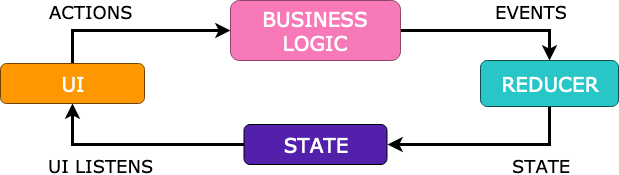
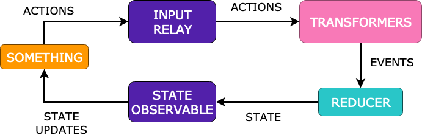
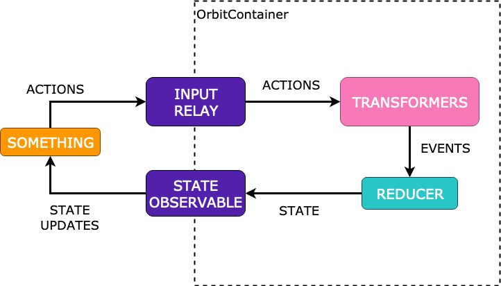

# Overview



Very briefly - this is how a typical Redux system works.

1. The UI sends actions asynchronously to some business component
1. The business component applies some business logic to the incoming events
1. The business component then emits some events further down the chain
1. Every event is reduced with the current state of the system to produce a new
   state
1. The state is then emitted back to the UI which renders itself based upon
   information within

## Implementation



We can map the above logic into concrete components on the orbit
implementation.

1. UI becomes `something` - this is because an orbit cycle can be used without
  any UI as a headless system.
1. Actions from the source `something` are sent to an action relay
1. Transformers are components applying business logic that listen to certain
   events coming out of that relay. They are optional, actions could also go
   straight to the reducer.
1. The transformers apply their business logic and spit out events of their own
1. The transformer events optionally end up in a reducer
1. The reducer reduces the current state of the system with the incoming event
   to produce a new state
1. The new state is sent to a state relay
1. Whatever is listening can consume the updated state

As you can see there is a near 1:1 mapping between MVI concepts and orbit
components.

### Orbit container



The system cannot exist in a vacuum. One of the key things about this
implementation is that it can run while nothing is connected to either relay.
This means you can have a system deliver reactive updates to the states based on
some external observable data source. An example could be some sort of
notification service listening on a socket even if there are no incoming actions
or nothing is listening to the emitted states at the time.

In order to make this possible we need to host a running Rx cycle observable
somewhere. We call this an `Orbit Container`. It:

- Hosts the redux cycle and keeps it running until disposed
- Allows you to dispose of the cycle when it's no longer needed
- Contains the relays used to interact with the cycle

### Working with Android


In order to work well with Android UI, we've also added a custom `OrbitViewModel`
that contains a `OrbitContainer` and helpfully ties the lifecycle of the redux
system to the lifecycle of the `ViewModel`.

You need to attach yourself to the `OrbitViewModel` on one of the
Activity/Fragment lifecycle methods. The view model will then automatically
detach any view state listeners in the opposite lifecycle method. Eg. if you
call `connect` in `onCreate` it will detach in `onDestroy` - `onStart`/`onStop`,
`onResume`/`onPause` etc. Note that while detached and the `ViewModel` is not
`cleared` the cycle will keep active, eg. running any network requests. As soon
as you reconnect the view, it will receive the latest view state fresh from
the oven, containing all updates that happened in the meantime.

### Threading

In a default `OrbitContainer`, every action sent to it is listened to on an IO
scheduler. The state updates will also come back on the IO scheduler. It's up
to the implementer to take care of listening on the correct thread.

An `OrbitViewModel` uses an `AndroidOrbitContainer` internally, which modifies
the output of the default one to listen in on the UI thread. This means that
from the UI perspective you do not need to worry about which thread to send or
receive events from.

### Error handling

It is required to handle all of your errors at the flow level. Orbit  
assumes no exceptions will be thrown or emitted by your streams.

Orbit has no error handling in place because your system could end up in
an undefined state. All unhandled errors are directed to the unhandled
exception handler and cause crashes.

### Saving State

Orbit supports automatic state saving on process death using the
[Saved State module for ViewModel](https://developer.android.com/topic/libraries/architecture/viewmodel-savedstate)

There are two conditions to make this work:

1. Your State can be put into an Android `Bundle`. Most commonly this will mean
   you need to implement the `Parcelable` interface on your state object.
   Using Kotlin's `@Parcelize`  is recommended for ease of use.
1. You need to pass in a `SavedStateHandle` to your `OrbitViewModel` at
   instantiation time. The easiest way to do this is via
   [Koin's support](https://doc.insert-koin.io/#/koin-android/viewmodel?id=viewmodel-and-state-bundle).
   This can be set up using Dagger as well but this could mean creating your own
   custom equivalent of `androidx.lifecycle.SavedStateViewModelFactory`
  
Koin Example:

``` kotlin
val viewModelModule = module {
    viewModel { (handle: SavedStateHandle) -> MyViewModel(handle) }
}

class MyViewModel(
    savedStateHandle: SavedStateHandle
): OrbitViewModel<Int, Unit>(0, savedStateHandle, {
        perform("Increment id")
            .on<Unit>()
            .reduce { currentState + 42 }
})
```
