# Orbit 2 Core

This is the core module for the Orbit 2 framework. It's worth familiarising
yourself with the [overview documentation](docs/orbit-2-overview.md) before
reading this section.

The core module provides all the basic parts of Orbit:

- Public API
- Core DSL
- Plugin registry
- Container implementation

## Architecture


This diagram shows a simple representation of how an Orbit system (or similar
systems like MVI/Redux/Cycle) works in simple principles.

1. The UI sends actions asynchronously to some business component
1. The business component applies some business logic to the incoming events
1. The business component then emits some events further down the chain
1. Every event is reduced with the current state of the system to produce a new
   state
1. The state is then emitted back to the UI which renders itself based upon
   information within

The main thing to remember is that the UI cannot make any business decisions
by itself. It should know only how to render itself based on the input state.

### Orbit concepts


We can map the above logic onto real components.

1. UI invokes functions on a class implementing the `ContainerHost` interface
1. The functions call through to a `Container` instance through the `orbit`
   DSL function
1. Transformers apply business logic that transforms function parameters into
   single or multiple events
1. The reducer reduces the current state of the system with the incoming events
   to produce new states
1. The new state is sent to observers

Notes:

- UI can be an `Activity`, `Fragment` or a simple `View`. An Orbit system can
  run even without any UI at all! Think of it as a background service.
- Orbit operators are applied within the `orbit` DSL function block
- All Orbit operators are optional.

### Side effects

In the real world such a system cannot exist with side effects. For example,
navigation between screens can be considered a side effect. As such there's a
third Orbit operator that can deal with side effects.



The UI does not have to be aware of all side effects (e.g. why should the UI
care if you send analytics events?). As such you can have side effects that do
not post any event back to the UI.

## Including the module

Orbit 2 is a modular framework. You will need this module to get started!

Additional functionality is provided through plugins included in separate
modules. Install only what you need!

```kotlin
implementation("com.babylon.orbit2:orbit-core:<latest-version>") // <-- This module is mandatory
```

## Orbit container

A [Container](src/main/java/com/babylon/orbit2/Container.kt) is the heart of
the Orbit MVI system. It retains the state, allows you to listen to side effect
and state updates and allows you to modify the state through the `orbit`
function which executes DSL operators of your desired business logic.

### ContainerHost

A [ContainerHost](src/main/java/com/babylon/orbit2/ContainerHost.kt) is not
strictly required to work with an Orbit
[Container](src/main/java/com/babylon/orbit2/Container.kt), but it simplifies
and organises access to it. A Host typically defines orbit flows (chains of DSL
operators to be invoked on the container) as functions that can be called by
e.g. the UI.

In a typical implementation one would subclass Android's `ViewModel` along with
implementing `ContainerHost` in order to create an Orbit-enabled Android
`ViewModel`.

## DSL plugin registry

Modules like `orbit-coroutines` or `orbit-rxjava2` contain plugins that extend
Orbit's DSL. In order for Orbit to recognise these plugins, they need to be
installed at runtime, like so:

``` kotlin
class MyApplication : Application() {
    override fun onCreate() {
        OrbitDslPlugins.register(
            CoroutineDslPlugin,
            RxJava2DslPlugin
        )
    }
}
```

The core syntax DSL plugin (`transform/sideEffect/reduce`) works out of the box
and does not need to be explicitly installed.

## Core DSL Operators

The Core DSL contains the following operators:

- transform
- sideEffect
- reduce

Transformers, side effects and reducers are invoked via simple DSL operators.
Operators are invoked via the `orbit` function in a `ContainerHost` (or, less
commonly, a `Container` directly)

``` kotlin
data class ExampleState(val seen: List<String> = emptyList())

sealed class ExampleSideEffect {
   data class Toast(val text: String)
}

class ExampleViewModel : ContainerHost<ExampleState, ExampleSideEffect>, ViewModel() {
    override val container = Container.create<ExampleState, ExampleSideEffect>(ExampleState())

    fun example(number: Int) = orbit {
       transform {
          number.toString()
       }
         .sideEffect { post(ExampleSideEffect.Toast(event)) }
         .reduce { currentState.copy(seen = currentState.seen + event) }
    }
}
```

Aside from the three DSL functions already mentioned, more operators are
provided via plugins providing e.g. support for `RxJava2` or Kotlin
`Coroutines`. In theory Orbit can work with any async and streaming framework -
plugins can be created easily.

### Transform

``` kotlin
class ExampleViewModel : ContainerHost<ExampleState, ExampleSideEffect> {
    ...

    fun example(number: Int) = orbit {
            transform { number * number }
        }
    }
    fun anotherExample() = orbit {
            transform { apiCall() }
                .transform { anotherApiCall(event) } // Use the result of the first api call
        }
    }
}
```

Transformers are akin to the `map` or `flatMap` functions recognisable from
popular stream libraries.

Their primary purpose is to change upstream data into a different type.
Transformers can do a simple mapping or do something much more complex like call
a backend API or subscribe to a stream of location updates.

### Reduce

``` kotlin
class ExampleViewModel : ContainerHost<ExampleState, ExampleSideEffect> {
    ...

    fun example(number: Int) = orbit {
        reduce { state.copy(currentState.total + number)}
    }

    fun anotherExample(number: Int) = orbit {
        transform { apiCall() }
            .reduce { state.copy(results = event.results) }
    }
}
```

Reducers take incoming events and the current state to produce a new state.

Reducers are pass-through operators. This means that after applying
a reducer, the upstream event is passed through unmodified to downstream
operators. This helps avoid having to create intermediate objects to retain
upstream events.

Operators downstream of a reducer can expect to be called only after the
upstream reduction has completed.

### Side effect

``` kotlin
class ExampleViewModel : ContainerHost<ExampleState, ExampleSideEffect> {
    ...

    fun example(number: Int) = orbit {
        sideEffect { trackSomething() }
    }

    fun anotherExample(number: Int) = orbit {
        transform { apiCall() }
            .sideEffect { post(ExampleSideEffect.Toast("event $event")) }
            .reduce { state.copy(results = event.results) }
    }
}
```

Working with any system will eventually generate side effects. We've made them a
first class citizen in Orbit.

This functionality is commonly used for things like truly one-off events,
navigation, logging, analytics etc.

You may use the `post` method within `sideEffect` in order to send the value to
a container's side effect stream. Use this for view-related side effects like
Toasts, Navigation, etc.

Side effects are pass-through operators. This means that after applying
a side effect, the upstream event is passed through unmodified to downstream
operators. This helps avoid having to create intermediate objects to retain
upstream events.

### Operator context

Commonly in an operator you need two things:

- The current state of the container
- The upstream event

Each Orbit operator lambda has a receiver that exposes the above as fields:

- `state`
- `event`

**The state is captured at the point when the operator lambda is called by the
Orbit container.** It will not change between invocations within the same
operator.

Examples of using the exposed fields:

``` kotlin
perform("Toast the current state")
class ExampleViewModel : ContainerHost<ExampleState, ExampleSideEffect> {
    ...

    fun anotherExample(number: Int) = orbit {
        transform { apiCall() }
            .sideEffect { post(ExampleSideEffect.Toast("state $state")) }
            .reduce { state.copy(results = event.results) }
    }
}
```

## Container factories

``` kotlin
perform("Toast the current state")
class ExampleViewModel : ContainerHost<ExampleState, ExampleSideEffect> {
    override val container = Container.create<ExampleState, ExampleSideEffect>(ExampleState()) {
        onCreate
    }

    fun onCreate() = orbit {
        ...
    }
}
```

Containers are typically not created directly but through convenient factory
functions. This allows you to pass through extra settings or a lambda to invoke
when he container is first created (important for containers that can be
recreated from a saved state or live longer than the UI).

Extra container factory functionality is provided via extension functions. One
example is `ViewModel` saved state support via a `SavedStateHandle`.

## Threading

Orbit is designed to provide a sane default threading model to cater for most of
the typical use cases. That being said you are not constrained and are free to
switch threads if you need to (e.g. for database access). Typically that is
done within particular `transform` blocks e.g. `transformSuspend`.

### Threading guarantees

- All calls to `Container.orbit` are executed on a separate thread so as not to
  block the caller (e.g. the UI).
- The convention is for all `transform` and `transformX` calls to execute in a
  separate `IO` coroutine so as not to block the Orbit container from accepting
  further events. This means e.g. backend calls can be safely executed directly
  in a `transformX` block without switching threads.
- Updates delivered via `Container.stateStream` and `Container.sideEffectStream`
  come in on the same thread you call `Stream.connect` on. However the
  connection to the stream has to be manually managed and cancelled. To make it
  more convenient to consume a `Stream` we have created wrappers to turn it into
  e.g. `LiveData`, a kotlin `Flow` or RxJava `Observable`.

## Error handling

It is good practice to handle all of your errors within your flows. Orbit  
does not provide any built-in exception handling because it cannot make
assumptions about how you respond to errors, avoiding putting your system in an
undefined state.
