# Orbit Core

This is the core module for the Orbit framework.
It provides all the basic parts of Orbit.

- [Orbit Core](#orbit-core)
  - [Architecture](#architecture)
    - [Orbit concepts](#orbit-concepts)
    - [Side effects](#side-effects)
      - [Limitations](#limitations)
  - [Including the module](#including-the-module)
  - [Orbit container](#orbit-container)
    - [Subscribing to the container](#subscribing-to-the-container)
    - [ContainerHost](#containerhost)
  - [Core Orbit operators](#core-orbit-operators)
    - [Transformation](#transformation)
    - [Reduction](#reduction)
    - [Side effect](#side-effect)
    - [Operator context in the simple syntax](#operator-context-in-the-simple-syntax)
    - [Operator context in the strict syntax](#operator-context-in-the-strict-syntax)
  - [Container factories](#container-factories)
  - [Threading](#threading)
    - [Threading guarantees](#threading-guarantees)
  - [Error handling](#error-handling)

## Architecture



This diagram shows a simple representation of how an Orbit system (or similar
systems like MVI/Redux/Cycle) works in simple principles.

1. The UI sends actions asynchronously to a business component.
1. The business component transforms the incoming events with business logic
1. The business component then emits these events further down the chain
1. Every event is reduced with the current state of the system to produce a new
   state
1. The state is then emitted back to the UI which renders itself based upon
   information within

The main thing to remember is that the UI cannot make any business decisions
by itself. It should know only how to render itself based on the input state.

### Orbit concepts



We can map the above logic onto real components.

1. UI invokes functions on a class implementing the
   [ContainerHost](src/commonMain/kotlin/org/orbitmvi/orbit/ContainerHost.kt)
   interface. Typically in Android this might be an Activity, Fragment
   or a simple View. However, an Orbit system can also be run without
   any UI, for example as a background service.
1. The functions call through to a
   [Container](src/commonMain/kotlin/org/orbitmvi/orbit/Container.kt) instance
   through the `orbit` or `intent` block which applies Orbit operators
1. Transformer operators apply business logic that transforms function
   parameters into single or multiple events
1. The reducer operator reduces the current state of the system with the
   incoming events to produce new states
1. The new state is sent to observers

Notes:

- All Orbit operators are optional.

### Side effects

In the real world such a system cannot exist without side effects. Side effects
are commonly truly one-off events like navigation, logging, analytics, toasts
etc that do not alter the state of the Orbit
[Container](src/commonMain/kotlin/org/orbitmvi/orbit/Container.kt). As such
there's a third Orbit operator that can deal with side effects.



The UI does not have to be aware of all side effects (e.g. why should the UI
care if you send analytics events?). As such you can have side effects that do
not post any event back to the UI.

Side effects are cached if there are no observers, guaranteeing critical
events such as navigation are delivered after re-subscription.

#### Limitations

`Container.sideEffectFlow` is designed to be collected by only one
observer. This ensures that side effect caching works in a predictable
way. If your particular use case requires multi-casting use `broadcast`
on the side effect flow, but be aware that caching will not work for the
resulting `BroadcastChannel`.

## Including the module

Orbit is a modular framework. You will need this module to get started!

Additional functionality is provided through optional modules.

```kotlin
implementation("org.orbit-mvi:orbit-core:<latest-version>")
```

## Orbit container

A [Container](src/commonMain/kotlin/org/orbitmvi/orbit/Container.kt) is the
heart of the Orbit MVI system. It retains the state, allows you to
listen to side effects and state updates and allows you to modify the
state through the `orbit` function which executes Orbit operators of
your desired business logic.

### Subscribing to the container

[Container](src/commonMain/kotlin/org/orbitmvi/orbit/Container.kt) exposes flows
that emit updates to the container state and side effects.

- State emissions are conflated
- Side effects are cached by default if no observers are listening. This
  can be changed via
  [Container Settings](src/commonMain/kotlin/org/orbitmvi/orbit/Container.kt#Settings)

``` kotlin
data class ExampleState(val seen: List<String> = emptyList())

sealed class ExampleSideEffect {
   data class Toast(val text: String)
}

fun main() {
    // create a container
    val container = container<ExampleState, ExampleSideEffect>(ExampleState())

    // subscribe to updates
    // For Android, use `lifecycleScope.launchWhenCreated` instead
    CoroutineScope(Dispatchers.Main).launch {
        container.stateFlow.collect {
            // do something with the state
        }
    }
    CoroutineScope(Dispatchers.Main).launch {
        container.sideEffectFlow.collect {
            // do something with the side effect
        }
    }
}

```

### ContainerHost

A [ContainerHost](src/commonMain/kotlin/org/orbitmvi/orbit/ContainerHost.kt) is
not strictly required to work with an Orbit
[Container](src/commonMain/kotlin/org/orbitmvi/orbit/Container.kt). However,
Orbit's syntax is defined as an extension on this class. Additionally it
simplifies and organises your business logic and so is highly recommended. A
[ContainerHost](src/commonMain/kotlin/org/orbitmvi/orbit/ContainerHost.kt)
typically defines MVI flows (your business logic and Orbit operators to be
invoked on the
[Container](src/commonMain/kotlin/org/orbitmvi/orbit/Container.kt)) as
functions that can be called by e.g. the UI.

In a typical implementation you would subclass Android's `ViewModel` and
implement
[ContainerHost](src/commonMain/kotlin/org/orbitmvi/orbit/ContainerHost.kt) in
order to create an Orbit-enabled Android `ViewModel`.

## Core Orbit operators

The Core module contains built-in Orbit operators:

| Operation / Syntax | [Strict](../strict-syntax.md) | [Simple](../simple-syntax.md) |
|--------------------|--------------------------|---------------------|
| block              | `orbit { ... }`            | `intent { ... }`      |
| transformation     | `transform { ... }`        | -                     |
| posted side effect | `sideEffect { post(...) }` | `postSideEffect(...)` |
| reduction          | `reduce { ... }`           | `reduce { ... }`      |

Operators are invoked through the block function in a
[ContainerHost](src/commonMain/kotlin/org/orbitmvi/orbit/ContainerHost.kt). For
more information about which threads these operators run on please see
[Threading](#threading).

For the [strict syntax](../strict-syntax.md), aside from the Orbit
operators already mentioned, more are provided via modules with support
for e.g. `RxJava2` or Kotlin `Coroutines`.

### Transformation

``` kotlin
class Example : ContainerHost<ExampleState, ExampleSideEffect> {
    ...

    fun simpleExample() = intent {
        anotherApiCall(apiCall()) // just call suspending functions
    }


    fun strictExample() = orbit {
        transform { apiCall() }
            .transform { anotherApiCall(event) } // "event" is the result of the first api call
    }
}
```

Transformations change upstream data into a different type. Transformers can do
a simple mapping or do something much more complex like call a backend API or
subscribe to a stream of location updates.

In the [simple syntax](../simple-syntax.md) the transformations are
simply suspend function calls inlined into the block function.

### Reduction

``` kotlin
class Example : ContainerHost<ExampleState, ExampleSideEffect> {
    ...

    fun simpleExample(number: Int) = intent {
        val result = apiCall()
        reduce { state.copy(results = result) }
    }

    fun strictExample(number: Int) = orbit {
        transform { apiCall() }
            .reduce { state.copy(results = event.results) }
    }
}
```

Reducers take incoming events and the current state to produce a new state.

**Note:** With the [strict syntax](../strict-syntax.md) reducers are
pass-through operators. This means that after applying a reducer, the
upstream event is passed through unmodified to downstream operators.
This helps avoid having to create intermediate objects to retain
upstream events. Operators downstream of a reducer can expect to be
called only after the upstream reduction has completed.

### Side effect

``` kotlin
class Example : ContainerHost<ExampleState, ExampleSideEffect> {
    ...

    fun simpleExample(number: Int) = intent {
        val result = apiCall()
        postSideEffect(ExampleSideEffect.Toast("result $result"))
        reduce { state.copy(results = result) }
    }

    fun strictExample(number: Int) = orbit {
        transform { apiCall() }
            .sideEffect { post(ExampleSideEffect.Toast("event $event")) }
            .reduce { state.copy(results = event.results) }
    }
}
```

Working with any system will eventually generate side effects. We've made them a
first class citizen in Orbit.

This functionality is commonly used for things like truly one-off events,
navigation, logging, analytics etc.

You may post the side effect in order to send it to a
[Container](src/commonMain/kotlin/org/orbitmvi/orbit/Container.kt)'s side
effect flow. Use this for view-related side effects like Toasts, Navigation,
etc.

**Note:** With the [strict syntax](../strict-syntax.md) side effects are
pass-through operators. This means that after applying a side effect,
the upstream event is passed through unmodified to downstream operators.
This helps avoid having to create intermediate objects to retain
upstream events.

### Operator context in the simple syntax

Each simple syntax operator lambda has a receiver that exposes the
current state of the
[Container](src/commonMain/kotlin/org/orbitmvi/orbit/Container.kt) as `state`

``` kotlin
perform("Toast the current state")
class Example : ContainerHost<ExampleState, ExampleSideEffect> {
    ...

    fun anotherExample(number: Int) = intent {
        val result = apiCall()
        postSideEffect(ExampleSideEffect.Toast("state $state"))
        reduce { state.copy(results = event.results) }
    }
}
```

### Operator context in the strict syntax

Commonly in an operator you need two things:

- The current state of the [Container](src/commonMain/kotlin/org/orbitmvi/orbit/Container.kt)
- The upstream event

Each Orbit operator lambda has a receiver that exposes the above as fields:

- `state`
- `event`

**Inside an operator invocation the same state value will be returned regardless
of what may be changing it in other threads.**

Examples of using the exposed fields:

``` kotlin
perform("Toast the current state")
class Example : ContainerHost<ExampleState, ExampleSideEffect> {
    ...

    fun anotherExample(number: Int) = orbit {
        transform { apiCall() }
            .sideEffect { post(ExampleSideEffect.Toast("state $state")) }
            .reduce { state.copy(results = event.results) }
    }
}
```

## Container factories

``` kotlin
perform("Toast the current state")
class Example : ContainerHost<ExampleState, ExampleSideEffect> {
    override val container = container<ExampleState, ExampleSideEffect>(ExampleState()) {
        onCreate()
    }

    fun onCreate() = intent {
        ...
    }
}
```

Containers are typically not created directly but through convenient factory
functions. This allows you to pass through extra settings or a lambda to invoke
when the [Container](src/commonMain/kotlin/org/orbitmvi/orbit/Container.kt) is
first created (important for containers that can be recreated from a saved
state or live longer than the UI).

Extra [Container](src/commonMain/kotlin/org/orbitmvi/orbit/Container.kt) factory
functionality is provided via extension functions. One example is `ViewModel`
saved state support via a `SavedStateHandle`.

## Threading

Orbit is designed to provide a sane default threading model to cater for most of
the typical use cases. That being said you are not constrained and are free to
switch threads if you need to (e.g. for database access). Typically that is
done within particular `transform` blocks e.g. `transformSuspend`.

### Threading guarantees

- Calls to `Container.orbit` or `Container.intent` do not block the caller. The
  operations within are offloaded to a background thread.
- `transform` and `transformX` calls execute in an `IO` thread so as not to
  block the Orbit [Container](src/commonMain/kotlin/org/orbitmvi/orbit/Container.kt)
  from accepting further events.

## Error handling

It is good practice to handle all of your errors within your flows.
Orbit does not provide any built-in exception handling because it cannot
make assumptions about how you respond to errors, avoiding putting your
system in an undefined state.
