# MVI and Orbit

This diagram shows a simple representation of how an Orbit system (or similar
systems like MVI/Redux/Cycle) works in simple principles.

1. The UI sends actions asynchronously to a business component.
1. The business component transforms the incoming events with business logic
1. The business component then emits these events further down the chain
1. Every event is reduced with the current state of the system to produce a new
   state
1. The state is then emitted back to the UI which renders itself based upon
   information within

The main thing to remember is that the UI cannot make any business decisions
by itself. It should know only how to render itself based on the input state.

## Orbit components

We can map the above logic onto real components.

1. UI invokes functions on a class implementing the
   [ContainerHost](pathname:///dokka/orbit-core/orbit-core/org.orbitmvi.orbit/-container-host/)
   interface. Typically in Android this might be an Activity, Fragment
   or a simple View. However, an Orbit system can also be run without
   any UI, for example as a background service.
1. The functions call through to a
   [Container](pathname:///dokka/orbit-core/orbit-core/org.orbitmvi.orbit/-container/)
   instance through the `intent` block which offloads work to a background
   coroutine and provides a DSL for side effects and reductions.
1. Transformations are performed through user-defined business logic within
   the `intent` block.
1. The reduce operator reduces the current state of the system with the
   incoming events to produce new states.
1. The new state is sent to observers.

Notes:

- All Orbit operators are optional.

## Side effects

In the real world such a system cannot exist without side effects. Side effects
are commonly truly one-off events like navigation, logging, analytics, toasts
etc that do not alter the state of the Orbit
[Container](pathname:///dokka/orbit-core/orbit-core/org.orbitmvi.orbit/-container/).
As such there's a third Orbit operator that can deal with side effects.

The UI does not have to be aware of all side effects (e.g. why should the UI
care if you send analytics events?). As such you can have side effects that do
not post any event back to the UI.
